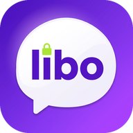

# LIBO 2.8.8 — поруч і на зв’язку

**Експериментальний Android-випуск** на базі 2.8.7. Android 8.0+ (API 26), targetSdk 35, пакет `app.libo.messenger`, versionCode `20808`.

[**Завантажити APK**](https://github.com/vladskod31-alt/my-first-apk/releases/download/v2.8.8/LIBO-2.8.8.apk) · [Реліз](https://github.com/vladskod31-alt/my-first-apk/releases/tag/v2.8.8) · [Запасне дзеркало APK](downloads/LIBO-2.8.8.apk) · [Список змін](CHANGELOG.md) · [Інструкція встановлення](downloads/README.md)



## Що додано

- **Спільний Wi-Fi / hotspot:** увімкнути локальний канал на обох телефонах і ввести IP іншого. Нативний TCP без сигнального сервера; повідомлення використовують наявний Double Ratchet. До 6 локальних каналів, обмежені кадри/черги. Новий локальний транспорт не відправляє повідомлення без E2EE.
- **Wi-Fi Direct (експериментально):** системний пошук, вибір пристрою, підтвердження групи; клієнт підключається до власника групи. Потребує сумісних Android-пристроїв і дозволів.
- **Реальні голосові виклики:** WebRTC DTLS-SRTP, SDP через автентифікований шифрований чат. Прийняття, відхилення, зайнято, mute, завершення, тайм-аут та звільнення мікрофона. **Тільки поки застосунок відкритий**; при згортанні/блокуванні дзвінок завершується. NFC/Bluetooth не переносять аудіо.
- **NFC NDEF-запрошення:** читання/перезапис форматованих міток публічним кодом та ключем. Контакт додається лише після підтвердження. **Не телефон ↔ телефон / Android Beam**.
- **Нова згенерована іконка:** реальні PNG у п’яти Android-плотностях, adaptive/round/themed icon, splash і вебіконки. [Перевірка всередині APK](downloads/ICON-VERIFICATION.json).
- Анімації натискання, появи діалогів і екрана виклику; враховано `prefers-reduced-motion`.
- Виправлено назву фонового сервісу в manifest; додано безпечний запит дозволу мікрофона лише локальній сторінці WebView.

Збережено чати, фото, Bluetooth P2P, локальне сховище, шифрування, теми, опитування, реакції, стікери та інші функції 2.8.7. Незалежного аудиту безпеки не проводили.

## Перевірено / не перевірено

- 40 модульних тестів і 13 Playwright-сценаріїв.
- Два браузерні клієнти встановлюють справжній WebRTC-аудіоканал: перевірено отримані RTP-байти, mute, завершення та відхилення. Джерело аудіо в CI синтетичне, не фізичний мікрофон.
- Збірка APK, підпис v2/v3, zipalign, пакет/версія/дозволи через AAPT2.
- Усередині APK перевірені усі 15 PNG launcher-ресурсів, їхні розміри й видимі пікселі; зображення витягнуто в [ICON-FROM-APK.png](downloads/ICON-FROM-APK.png).
- **Встановлення/запуск на фізичному Android, Wi-Fi Direct, NFC та дзвінок між двома телефонами ще не перевірені.** Деталі: [TESTING.md](TESTING.md), [KNOWN_ISSUES.md](KNOWN_ISSUES.md).

## Увага: зміна підпису

Ключ попередньої 2.8.7 недоступний. Цей APK підписано новим тестовим ключем, тому він **не є безшовним оновленням** поверх APK з іншим підписом. Перед видаленням старої версії експортуйте текст; фото, ключі та налаштування експорт не переносить. Імпорт створює архів лише для читання. Не видаляйте застосунок, поки не збережете важливе. [Докладно](downloads/README.md).

## Розробка

```sh
npm ci
npm test
npm run test:e2e
npm run dev
npm run build
# Standard Android SDK + JDK 17:
./gradlew assembleDebug
# Alternative pinned toolchain (outside Git):
node scripts/bootstrap-toolchain.mjs
# Set JAVA_HOME and LIBO_TOOLCHAIN as printed by bootstrap:
bash scripts/build-apk-local.sh
python3 scripts/verify-apk-icons.py artifacts/LIBO-2.8.8.apk
```

Генерація Android-ресурсів із збереженого зображення: `python3 scripts/make-icons-288.py` (Pillow). Приватні ключі не зберігаються в Git. CI для релізу потребує налаштованих секретів підпису й відмовляється публікувати непідписаний APK.

### Структура

- `web/` — інтерфейс і протоколи; `lib/calls.mjs`, `nearby-ui.mjs`, `transport.mjs`.
- `app/` — Android WebView, `NearbyLinks`, `NfcInvites`, Bluetooth та ресурси.
- `tests/` — unit та браузерні інтеграційні тести.
- `downloads/` — APK-дзеркало, SHA-256, звіт підпису та перевірки іконки.
- `docs/NEARBY.md` — використання Wi-Fi, Direct, NFC і викликів.
- `docs/releases/2.8.7.md` — історичні нотатки попереднього випуску (не результати перевірки 2.8.8).

Публікація — GitHub Releases і PR цієї робочої гілки. Публікація у Google Play чи сторонніх магазинах не виконувалася.

[Фактичний CI/публікаційний звіт](docs/VALIDATION-2.8.8.md): Gradle-збірка і тести успішні; неблокувальний Android lint завершився кодом 1. Фізичне встановлення не перевірене.
